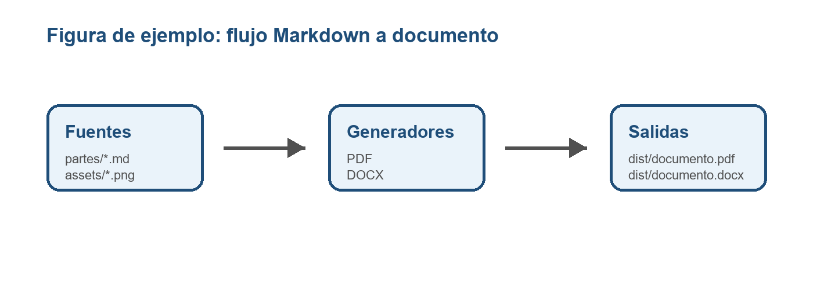

# 1. Seccion de ejemplo

Este documento se genera desde Markdown y puede exportarse a PDF y DOCX.

## 1.1 Lista

- Primer punto.
- Segundo punto.
- Tercer punto.

## 1.2 Tabla

| Elemento | Descripcion |
| --- | --- |
| `partes/` | Markdown fuente del documento. |
| `assets/` | Imagenes usadas por las figuras. |
| `dist/` | Salidas generadas. |

## 1.3 Figuras

Para meter figuras, guarda una imagen en `assets/` y referenciala con esta sintaxis:

{width=16}

El generador resuelve la ruta desde el fichero Markdown donde aparece la figura.
