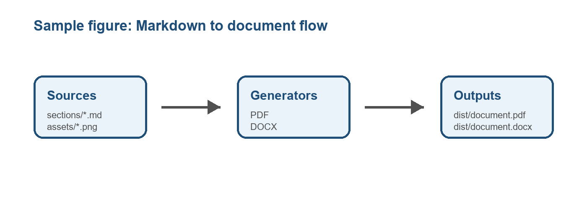

# 1. Sample Section

This document is generated from Markdown and can be exported to PDF and DOCX.

## 1.1 List

- First item.
- Second item.
- Third item.

## 1.2 Table

| Item | Description |
| --- | --- |
| `sections/` | Markdown source files. |
| `assets/` | Images used by figures. |
| `dist/` | Generated outputs. |

## 1.3 Figures

To add figures, store an image in `assets/` and reference it with this syntax:

{width=16}

The generator resolves the path from the Markdown file where the figure appears.
